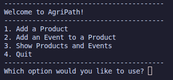
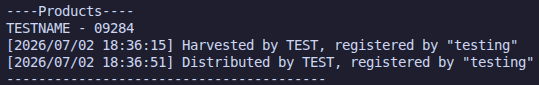

# AgriPath 🌾 🚧


A system that tracks the journey of an agricultural product from its origin to the final consumer.

⚠️ **Alpha software.** AgriPath is in early development. Expect breaking changes, missing features, and an evolving architecture until a stable release is tagged.

## About

An agricultural product goes through multiple stages before reaching the end consumer. AgriPath enables every step of this journey to be accurately tracked, providing detailed records, timestamps, and descriptions throughout the supply chain.

Tracking begins at the point of production or harvest and continues through distributors, wholesalers, retailers, and other participants until the product reaches the consumer.

The project's goal is to increase transparency and traceability across the agricultural supply chain, giving every participant clear visibility into a product's journey while also helping consumers better understand how agricultural products reach their tables.

## How It Works

**AgriPath** is built around a **Product** and an **Event**.

**Product**: A Product represents an agricultural item being tracked throughout the supply chain. Each product has a unique identifier and a name, allowing it to be uniquely recognized and traced.

Additionally, every product maintains a collection of Events, which together form its complete lifecycle history.

**Event**: An Event represents a single stage in a product's journey. Each event contains:

- Description – A summary of the action performed (e.g., Harvested, Packaged, Shipped).
- Registered By – The individual or organization responsible for the action.
- Timestamp – The date and time when the event occurred.

One of the most important design decisions is that Events are immutable. Once created, an event cannot be modified or deleted. This reflects the nature of real-world traceability systems, where historical records should remain permanent and tamper-resistant, ensuring the integrity of the product's history.

## Features

- [X] Simple CLI menu
- [X] Register Product and Events
- [X] Save a list of Products
- [X] Display Product and Events


## Demo

**Main CLI Menu**:



**History Menu**:



## Tech Stack


| Stack | Usage                  |
|------------|-----------------------|
| Python         | Backend Language      |

## Project Structure

```
agripath/
├── assets/
├── models/             # Models classes
│   ├── event.py
│   └── product.py
├── src/
│   └── menu.py         # CLI menu                     
├── .gitignore
├── main.py
├── pyproject.toml
└── README.md
```

## Getting Started

### Prerequisites

- Python 3.12.3 or lower

### Installation

1. Clone the repository:

```bash
git clone https://github.com/luis-manfredi/agripath.git
cd agripath
```

2. (Optional) Create a virtual enviroment:

```bash
python -m venv .venv
```

Linux/macOS:

```bash
source .venv/bin/activate
```

Windows:

```bash
.venv\Scripts\activate
```

> **Note:** AgriPath currently has no external dependencies — no `pip install` step is required.

### Usage

Run the CLI:
```bash
python main.py
```

## Roadmap

- [ ] Persist data with PostgreSQL
- [ ] REST API
- [ ] Multi-actor authentication

## License

This project is licensed under the MIT License - see the [LICENSE](LICENSE) file for details.

## Author
**Luís Antonio Manfredi Sodré**
- [GitHub](https://github.com/luismanfredi)
- [Email](mailto:luismanfredi920@gmail.com)